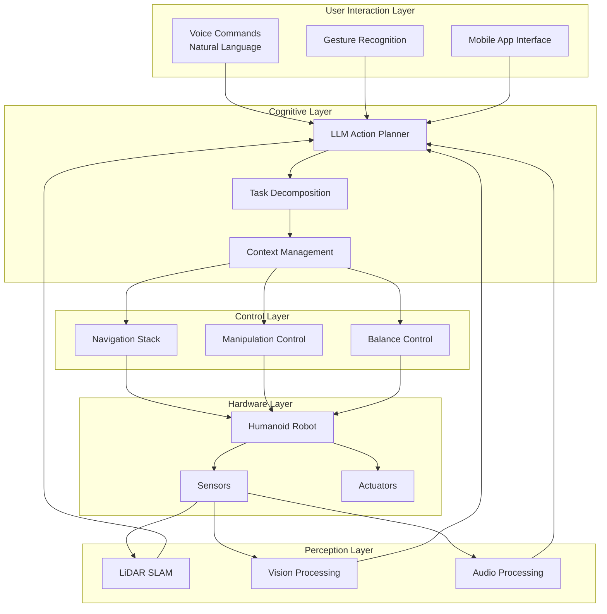

# Chapter 4.3: Capstone Project: Building the Autonomous Humanoid (Integration)

## Introduction to the Capstone Project

This capstone project brings together all the concepts learned throughout the previous modules to create a complete autonomous humanoid robot system. We'll integrate ROS 2 navigation, NVIDIA Isaac simulation, Vision-Language-Action models, and voice command interfaces into a unified system.

## System Architecture Overview

### High-Level Architecture



### Integration Points

The capstone system integrates multiple technologies:

1. **Voice Command Interface** (from Chapter 4.1)
2. **Cognitive Planning** (from Chapter 4.2)
3. **Navigation & Control** (from Module 3)
4. **Perception Systems** (from Module 2)
5. **Robotics Fundamentals** (from Module 1)

## Complete System Implementation

### Main Integration Node

```python
#!/usr/bin/env python3
"""
Main integration node for the autonomous humanoid system
"""

import rclpy
from rclpy.node import Node
from rclpy.qos import QoSProfile, ReliabilityPolicy, DurabilityPolicy
from rclpy.action import ActionClient
from rclpy.callback_groups import ReentrantCallbackGroup
from rclpy.executors import MultiThreadedExecutor

# Standard ROS 2 messages
from std_msgs.msg import String, Bool
from sensor_msgs.msg import Image, LaserScan, Imu, JointState
from geometry_msgs.msg import PoseStamped, Twist
from nav_msgs.msg import Odometry
from builtin_interfaces.msg import Duration

# Custom messages and actions
from humanoid_interfaces.msg import (
    VoiceCommand,
    SystemStatus,
    HumanoidState,
    TaskPlan
)
from humanoid_interfaces.action import (
    ExecuteTask,
    NavigateToPose,
    ManipulateObject,
    SpeakResponse
)

# Service definitions
from humanoid_interfaces.srv import (
    QueryKnowledge,
    UpdateMap,
    CalibrateSensors
)

# Third-party imports
import openai
import numpy as np
import cv2
import yaml
import asyncio
import threading
import queue
import time
from typing import Dict, List, Optional, Tuple, Any
import json

class AutonomousHumanoidSystem(Node):
    """
    Main integration node that coordinates all subsystems of the autonomous humanoid
    """

    def __init__(self):
        super().__init__('autonomous_humanoid_system')

        # Configuration
        self.config = self.load_configuration()

        # Initialize subsystems
        self.voice_interface = VoiceCommandInterface(self)
        self.cognitive_planner = LLMCognitivePlanner(self)
        self.navigation_system = NavigationSystem(self)
        self.manipulation_system = ManipulationSystem(self)
        self.perception_system = PerceptionSystem(self)
        self.safety_system = SafetySystem(self)

        # State management
        self.current_state = HumanoidState()
        self.current_task = None
        self.task_queue = queue.Queue()

        # Publishers
        self.status_pub = self.create_publisher(SystemStatus, 'system_status', 10)
        self.state_pub = self.create_publisher(HumanoidState, 'humanoid_state', 10)

        # Subscribers
        self.emergency_stop_sub = self.create_subscription(
            Bool, 'emergency_stop', self.emergency_stop_callback, 10
        )

        # Action clients
        self.task_executor_client = ActionClient(
            self, ExecuteTask, 'execute_task'
        )

        # Services
        self.query_service = self.create_service(
            QueryKnowledge, 'query_knowledge', self.query_knowledge_callback
        )

        self.calibrate_service = self.create_service(
            CalibrateSensors, 'calibrate_sensors', self.calibrate_sensors_callback
        )

        # Timers
        self.status_timer = self.create_timer(
            1.0, self.publish_system_status, callback_group=ReentrantCallbackGroup()
        )

        # Task processing timer
        self.task_timer = self.create_timer(
            0.1, self.process_task_queue, callback_group=ReentrantCallbackGroup()
        )

        # Initialize systems
        self.initialize_systems()

        self.get_logger().info("Autonomous Humanoid System initialized successfully")

    def load_configuration(self) -> Dict:
        """
        Load system configuration from parameter server or config file
        """
        config = {}

        # Load from parameter server
        self.declare_parameter('robot_name', 'autonomous_humanoid')
        self.declare_parameter('max_linear_speed', 0.5)
        self.declare_parameter('max_angular_speed', 0.5)
        self.declare_parameter('safety_distance', 0.5)
        self.declare_parameter('openai_api_key', '')

        config['robot_name'] = self.get_parameter('robot_name').value
        config['max_linear_speed'] = self.get_parameter('max_linear_speed').value
        config['max_angular_speed'] = self.get_parameter('max_angular_speed').value
        config['safety_distance'] = self.get_parameter('safety_distance').value
        config['openai_api_key'] = self.get_parameter('openai_api_key').value

        # Load additional config from file if specified
        config_file = self.declare_parameter('config_file', '').value
        if config_file:
            with open(config_file, 'r') as f:
                file_config = yaml.safe_load(f)
                config.update(file_config)

        return config

    def initialize_systems(self):
        """
        Initialize all subsystems
        """
        try:
            # Initialize voice interface
            self.voice_interface.initialize()
            self.get_logger().info("Voice interface initialized")

            # Initialize cognitive planner
            self.cognitive_planner.initialize()
            self.get_logger().info("Cognitive planner initialized")

            # Initialize navigation system
            self.navigation_system.initialize()
            self.get_logger().info("Navigation system initialized")

            # Initialize manipulation system
            self.manipulation_system.initialize()
            self.get_logger().info("Manipulation system initialized")

            # Initialize perception system
            self.perception_system.initialize()
            self.get_logger().info("Perception system initialized")

            # Initialize safety system
            self.safety_system.initialize()
            self.get_logger().info("Safety system initialized")

            self.get_logger().info("All subsystems initialized successfully")

        except Exception as e:
            self.get_logger().error(f"Error initializing systems: {str(e)}")
            raise

    def emergency_stop_callback(self, msg: Bool):
        """
        Handle emergency stop commands
        """
        if msg.data:
            self.get_logger().warn("EMERGENCY STOP ACTIVATED")
            self.safety_system.emergency_stop()
            self.current_task = None
            self.task_queue.queue.clear()

    def process_task_queue(self):
        """
        Process tasks from the queue
        """
        if not self.task_queue.empty():
            try:
                task = self.task_queue.get_nowait()
                self.execute_task(task)
            except queue.Empty:
                pass

    def execute_task(self, task: TaskPlan):
        """
        Execute a single task
        """
        self.get_logger().info(f"Executing task: {task.description}")

        try:
            # Update current state
            self.current_task = task

            # Execute based on task type
            if task.task_type == "navigation":
                self.navigation_system.execute_navigation_task(task)
            elif task.task_type == "manipulation":
                self.manipulation_system.execute_manipulation_task(task)
            elif task.task_type == "communication":
                self.voice_interface.execute_communication_task(task)
            elif task.task_type == "perception":
                self.perception_system.execute_perception_task(task)
            else:
                self.get_logger().error(f"Unknown task type: {task.task_type}")
                return False

            return True

        except Exception as e:
            self.get_logger().error(f"Error executing task: {str(e)}")
            return False

    def query_knowledge_callback(self, request, response):
        """
        Handle knowledge queries
        """
        try:
            knowledge = self.cognitive_planner.query_knowledge(request.query)
            response.answer = knowledge
            response.success = True
        except Exception as e:
            response.answer = f"Error querying knowledge: {str(e)}"
            response.success = False

        return response

    def calibrate_sensors_callback(self, request, response):
        """
        Handle sensor calibration
        """
        try:
            calibration_result = self.perception_system.calibrate_sensors()
            response.success = calibration_result
            response.message = "Sensors calibrated successfully" if calibration_result else "Calibration failed"
        except Exception as e:
            response.success = False
            response.message = f"Calibration error: {str(e)}"

        return response

    def publish_system_status(self):
        """
        Publish system status
        """
        status_msg = SystemStatus()
        status_msg.header.stamp = self.get_clock().now().to_msg()
        status_msg.robot_name = self.config['robot_name']
        status_msg.current_task = self.current_task.description if self.current_task else "idle"
        status_msg.battery_level = self.get_battery_level()
        status_msg.system_health = self.get_system_health()
        status_msg.operational_mode = "autonomous"  # Could be manual, autonomous, etc.

        self.status_pub.publish(status_msg)

    def get_battery_level(self) -> float:
        """
        Get current battery level (mock implementation)
        """
        # In a real system, this would interface with battery monitoring
        return 0.85  # 85% charge

    def get_system_health(self) -> int:
        """
        Get system health status (0-100 scale)
        """
        # In a real system, this would aggregate health from all subsystems
        return 95  # Good health

    def shutdown(self):
        """
        Graceful shutdown of the system
        """
        self.get_logger().info("Shutting down Autonomous Humanoid System...")

        # Stop all subsystems
        self.voice_interface.shutdown()
        self.cognitive_planner.shutdown()
        self.navigation_system.shutdown()
        self.manipulation_system.shutdown()
        self.perception_system.shutdown()
        self.safety_system.shutdown()

        self.get_logger().info("Autonomous Humanoid System shutdown complete")


class VoiceCommandInterface:
    """
    Voice command interface that integrates with the cognitive planner
    """

    def __init__(self, node: AutonomousHumanoidSystem):
        self.node = node
        self.voice_sub = node.create_subscription(
            VoiceCommand, 'voice_command', self.voice_command_callback, 10
        )

        # Initialize OpenAI client
        api_key = node.config.get('openai_api_key')
        if api_key:
            from openai import OpenAI
            self.openai_client = OpenAI(api_key=api_key)
        else:
            self.openai_client = None
            self.node.get_logger().warn("OpenAI API key not configured - voice commands will be limited")

        # Text-to-speech publisher
        self.tts_pub = node.create_publisher(String, 'tts_input', 10)

    def initialize(self):
        """
        Initialize voice command interface
        """
        pass

    def voice_command_callback(self, msg: VoiceCommand):
        """
        Handle incoming voice commands
        """
        self.node.get_logger().info(f"Received voice command: {msg.command}")

        if self.openai_client:
            # Use LLM to process command and generate plan
            plan = self.process_command_with_llm(msg.command)
        else:
            # Fallback to simple command parsing
            plan = self.process_command_simple(msg.command)

        if plan:
            self.node.task_queue.put(plan)
        else:
            self.speak_response("I couldn't understand your command. Could you please repeat it?")

    def process_command_with_llm(self, command: str) -> Optional[TaskPlan]:
        """
        Process command using LLM cognitive planner
        """
        try:
            prompt = f"""
            Natural language command: "{command}"

            Convert this command into a structured task plan for a humanoid robot.

            Available capabilities:
            - Navigation: Move to locations, avoid obstacles
            - Manipulation: Pick up, place, grasp objects
            - Perception: Look for objects, recognize people
            - Communication: Speak responses, acknowledge commands

            Response format:
            {{
                "task_type": "navigation|manipulation|perception|communication",
                "parameters": {{"key": "value"}},
                "description": "Brief description",
                "priority": 1-5
            }}

            Generate the task plan:
            """

            response = self.openai_client.chat.completions.create(
                model="gpt-4-turbo",
                messages=[
                    {"role": "system", "content": "You are a task planner for a humanoid robot. Generate structured task plans from natural language commands."},
                    {"role": "user", "content": prompt}
                ],
                response_format={"type": "json_object"}
            )

            plan_data = json.loads(response.choices[0].message.content)

            task_plan = TaskPlan()
            task_plan.task_type = plan_data.get('task_type', 'unknown')
            task_plan.description = plan_data.get('description', command)
            task_plan.priority = plan_data.get('priority', 3)

            # Convert parameters to string (in a real system, you'd use a proper message type)
            task_plan.parameters = json.dumps(plan_data.get('parameters', {}))

            return task_plan

        except Exception as e:
            self.node.get_logger().error(f"Error processing voice command with LLM: {str(e)}")
            return None

    def process_command_simple(self, command: str) -> Optional[TaskPlan]:
        """
        Simple command processing without LLM
        """
        # Simple keyword-based command parsing
        command_lower = command.lower()

        if any(word in command_lower for word in ['go to', 'navigate to', 'move to']):
            task_plan = TaskPlan()
            task_plan.task_type = 'navigation'
            task_plan.description = command
            task_plan.priority = 3
            return task_plan

        elif any(word in command_lower for word in ['pick up', 'grasp', 'get']):
            task_plan = TaskPlan()
            task_plan.task_type = 'manipulation'
            task_plan.description = command
            task_plan.priority = 4
            return task_plan

        elif any(word in command_lower for word in ['look for', 'find', 'search for']):
            task_plan = TaskPlan()
            task_plan.task_type = 'perception'
            task_plan.description = command
            task_plan.priority = 2
            return task_plan

        else:
            return None

    def execute_communication_task(self, task: TaskPlan):
        """
        Execute a communication task
        """
        response_msg = String()
        response_msg.data = task.description  # In a real system, this would be a proper response
        self.tts_pub.publish(response_msg)

    def speak_response(self, text: str):
        """
        Speak a response
        """
        msg = String()
        msg.data = text
        self.tts_pub.publish(msg)

    def shutdown(self):
        """
        Shutdown voice interface
        """
        pass


class LLMCognitivePlanner:
    """
    LLM-based cognitive planner for high-level task planning
    """

    def __init__(self, node: AutonomousHumanoidSystem):
        self.node = node

        # Initialize OpenAI client
        api_key = node.config.get('openai_api_key')
        if api_key:
            from openai import OpenAI
            self.openai_client = OpenAI(api_key=api_key)
        else:
            self.openai_client = None
            self.node.get_logger().warn("OpenAI API key not configured for cognitive planner")

    def initialize(self):
        """
        Initialize cognitive planner
        """
        pass

    def query_knowledge(self, query: str) -> str:
        """
        Query the system's knowledge base using LLM
        """
        if not self.openai_client:
            return "Knowledge base not available - LLM not configured"

        try:
            response = self.openai_client.chat.completions.create(
                model="gpt-4-turbo",
                messages=[
                    {"role": "system", "content": "You are a helpful assistant with knowledge about the robot's capabilities and environment."},
                    {"role": "user", "content": query}
                ]
            )

            return response.choices[0].message.content

        except Exception as e:
            self.node.get_logger().error(f"Error querying knowledge: {str(e)}")
            return f"Error querying knowledge: {str(e)}"

    def shutdown(self):
        """
        Shutdown cognitive planner
        """
        pass


class NavigationSystem:
    """
    Navigation system using ROS 2 Navigation Stack
    """

    def __init__(self, node: AutonomousHumanoidSystem):
        self.node = node

        # Action client for navigation
        self.nav_client = ActionClient(node, NavigateToPose, 'navigate_to_pose')

        # Subscribers for navigation data
        self.odom_sub = node.create_subscription(
            Odometry, 'odom', self.odom_callback, 10
        )

        self.map_sub = node.create_subscription(
            OccupancyGrid, 'map', self.map_callback, 10
        )

        # Current robot state
        self.current_pose = None
        self.current_velocity = None
        self.map_data = None

    def initialize(self):
        """
        Initialize navigation system
        """
        # Wait for navigation server
        if not self.nav_client.wait_for_server(timeout_sec=5.0):
            self.node.get_logger().warn("Navigation server not available")

    def odom_callback(self, msg: Odometry):
        """
        Handle odometry updates
        """
        self.current_pose = msg.pose.pose
        self.current_velocity = msg.twist.twist

    def map_callback(self, msg: OccupancyGrid):
        """
        Handle map updates
        """
        self.map_data = msg

    def execute_navigation_task(self, task: TaskPlan):
        """
        Execute a navigation task
        """
        try:
            # Parse navigation parameters from task
            params = json.loads(task.parameters)
            target_location = params.get('target_location')

            if target_location:
                # Convert location name to pose (this would use a location database)
                target_pose = self.resolve_location_to_pose(target_location)

                if target_pose:
                    # Send navigation goal
                    goal_msg = NavigateToPose.Goal()
                    goal_msg.pose = target_pose

                    future = self.nav_client.send_goal_async(goal_msg)

                    # Wait for result with timeout
                    rclpy.spin_until_future_complete(self.node, future, timeout_sec=30.0)

                    goal_handle = future.result()
                    if goal_handle.accepted:
                        result_future = goal_handle.get_result_async()
                        rclpy.spin_until_future_complete(self.node, result_future, timeout_sec=60.0)

                        result = result_future.result()
                        if result.result.success:
                            self.node.get_logger().info(f"Successfully navigated to {target_location}")
                        else:
                            self.node.get_logger().error(f"Navigation to {target_location} failed")
                    else:
                        self.node.get_logger().error(f"Navigation goal to {target_location} was rejected")
                else:
                    self.node.get_logger().error(f"Could not resolve location: {target_location}")
            else:
                self.node.get_logger().error("No target location specified in navigation task")

        except Exception as e:
            self.node.get_logger().error(f"Error executing navigation task: {str(e)}")

    def resolve_location_to_pose(self, location_name: str) -> Optional[Pose]:
        """
        Resolve a location name to a Pose in the map
        """
        # In a real system, this would query a semantic map or location database
        location_map = {
            "kitchen": Pose(position=Point(x=5.0, y=2.0, z=0.0)),
            "office": Pose(position=Point(x=1.0, y=8.0, z=0.0)),
            "living_room": Pose(position=Point(x=3.0, y=5.0, z=0.0)),
            "bedroom": Pose(position=Point(x=8.0, y=3.0, z=0.0)),
            "charging_station": Pose(position=Point(x=0.0, y=0.0, z=0.0)),
        }

        return location_map.get(location_name.lower())

    def shutdown(self):
        """
        Shutdown navigation system
        """
        pass


class ManipulationSystem:
    """
    Manipulation system for object interaction
    """

    def __init__(self, node: AutonomousHumanoidSystem):
        self.node = node

        # Action client for manipulation
        self.manip_client = ActionClient(
            node, ManipulateObject, 'manipulation_controller/manipulate_object'
        )

        # Joint state subscriber
        self.joint_state_sub = node.create_subscription(
            JointState, 'joint_states', self.joint_state_callback, 10
        )

        # Current joint states
        self.joint_states = {}

    def initialize(self):
        """
        Initialize manipulation system
        """
        if not self.manip_client.wait_for_server(timeout_sec=5.0):
            self.node.get_logger().warn("Manipulation server not available")

    def joint_state_callback(self, msg: JointState):
        """
        Handle joint state updates
        """
        for name, position in zip(msg.name, msg.position):
            self.joint_states[name] = position

    def execute_manipulation_task(self, task: TaskPlan):
        """
        Execute a manipulation task
        """
        try:
            params = json.loads(task.parameters)
            action = params.get('action')
            object_name = params.get('object')

            if action and object_name:
                goal_msg = ManipulateObject.Goal()
                goal_msg.action = action
                goal_msg.object_name = object_name

                future = self.manip_client.send_goal_async(goal_msg)
                rclpy.spin_until_future_complete(self.node, future, timeout_sec=10.0)

                goal_handle = future.result()
                if goal_handle.accepted:
                    result_future = goal_handle.get_result_async()
                    rclpy.spin_until_future_complete(self.node, result_future, timeout_sec=30.0)

                    result = result_future.result()
                    if result.result.success:
                        self.node.get_logger().info(f"Successfully executed manipulation: {action} {object_name}")
                    else:
                        self.node.get_logger().error(f"Manipulation failed: {action} {object_name}")
            else:
                self.node.get_logger().error("Invalid manipulation parameters")

        except Exception as e:
            self.node.get_logger().error(f"Error executing manipulation task: {str(e)}")

    def shutdown(self):
        """
        Shutdown manipulation system
        """
        pass


class PerceptionSystem:
    """
    Perception system for environment understanding
    """

    def __init__(self, node: AutonomousHumanoidSystem):
        self.node = node

        # Subscribers for various sensors
        self.image_sub = node.create_subscription(
            Image, 'camera/rgb/image_raw', self.image_callback, 10
        )

        self.lidar_sub = node.create_subscription(
            LaserScan, 'scan', self.lidar_callback, 10
        )

        self.imu_sub = node.create_subscription(
            Imu, 'imu/data', self.imu_callback, 10
        )

        # Latest sensor data
        self.latest_image = None
        self.latest_scan = None
        self.latest_imu = None

    def initialize(self):
        """
        Initialize perception system
        """
        pass

    def image_callback(self, msg: Image):
        """
        Handle image data
        """
        self.latest_image = msg

    def lidar_callback(self, msg: LaserScan):
        """
        Handle LiDAR data
        """
        self.latest_scan = msg

    def imu_callback(self, msg: Imu):
        """
        Handle IMU data
        """
        self.latest_imu = msg

    def execute_perception_task(self, task: TaskPlan):
        """
        Execute a perception task
        """
        try:
            params = json.loads(task.parameters)
            target_object = params.get('target_object')

            if target_object:
                # In a real system, this would perform object detection/recognition
                # For now, we'll simulate detection
                detected = self.simulate_object_detection(target_object)

                if detected:
                    self.node.get_logger().info(f"Detected {target_object}")
                    # Could trigger other actions based on detection
                else:
                    self.node.get_logger().info(f"Could not detect {target_object}")
            else:
                self.node.get_logger().error("No target object specified in perception task")

        except Exception as e:
            self.node.get_logger().error(f"Error executing perception task: {str(e)}")

    def simulate_object_detection(self, target_object: str) -> bool:
        """
        Simulate object detection (in a real system, this would use computer vision)
        """
        # Simulate detection with 80% success rate
        import random
        return random.random() < 0.8

    def calibrate_sensors(self) -> bool:
        """
        Calibrate all sensors
        """
        self.node.get_logger().info("Calibrating sensors...")

        # In a real system, this would perform actual calibration procedures
        # For now, we'll just return success
        time.sleep(2)  # Simulate calibration time

        self.node.get_logger().info("Sensor calibration complete")
        return True

    def shutdown(self):
        """
        Shutdown perception system
        """
        pass


class SafetySystem:
    """
    Safety system for ensuring safe operation
    """

    def __init__(self, node: AutonomousHumanoidSystem):
        self.node = node

        # Safety parameters
        self.safety_distance = node.config.get('safety_distance', 0.5)
        self.emergency_stop_active = False
        self.safety_violations = []

        # Timer for safety checks
        self.safety_timer = node.create_timer(0.1, self.safety_check)

    def initialize(self):
        """
        Initialize safety system
        """
        self.node.get_logger().info("Safety system initialized")

    def safety_check(self):
        """
        Perform safety checks
        """
        if self.emergency_stop_active:
            return

        # Check for safety violations
        violations = self.check_safety_violations()

        if violations:
            self.safety_violations.extend(violations)

            # If critical safety violation, activate emergency stop
            if any("critical" in v.lower() for v in violations):
                self.emergency_stop()
                self.node.get_logger().error(f"Safety violations detected: {violations}")

    def check_safety_violations(self) -> List[str]:
        """
        Check for safety violations
        """
        violations = []

        # Check for proximity to obstacles (simplified)
        # In a real system, this would interface with collision detection
        if hasattr(self.node.perception_system, 'latest_scan'):
            scan = self.node.perception_system.latest_scan
            if scan and min(scan.ranges) < self.safety_distance:
                violations.append(f"Obstacle too close: {min(scan.ranges):.2f}m < {self.safety_distance}m")

        # Check for excessive joint velocities (simplified)
        if hasattr(self.node.manipulation_system, 'joint_states'):
            # Check if any joint velocities are excessive
            pass

        return violations

    def emergency_stop(self):
        """
        Activate emergency stop
        """
        if not self.emergency_stop_active:
            self.emergency_stop_active = True
            self.node.get_logger().warn("EMERGENCY STOP ACTIVATED")

            # Stop all motion
            cmd_vel_pub = self.node.create_publisher(Twist, 'cmd_vel', 10)
            stop_msg = Twist()
            cmd_vel_pub.publish(stop_msg)

            # Clear task queue
            self.node.task_queue.queue.clear()
            self.node.current_task = None

    def shutdown(self):
        """
        Shutdown safety system
        """
        pass


def main(args=None):
    """
    Main function to run the autonomous humanoid system
    """
    rclpy.init(args=args)

    try:
        # Create the main system node
        system_node = AutonomousHumanoidSystem()

        # Create multi-threaded executor
        executor = MultiThreadedExecutor(num_threads=8)
        executor.add_node(system_node)

        # Add other nodes if needed
        # executor.add_node(other_node)

        system_node.get_logger().info("Starting Autonomous Humanoid System...")

        try:
            executor.spin()
        except KeyboardInterrupt:
            system_node.get_logger().info("Keyboard interrupt received")
        finally:
            system_node.shutdown()
            executor.shutdown()

    except Exception as e:
        print(f"Error running Autonomous Humanoid System: {str(e)}")
        raise
    finally:
        rclpy.shutdown()


if __name__ == '__main__':
    main()
```

## Isaac Sim Integration

### Isaac Sim Environment for Testing

```python
# Isaac Sim integration for testing the autonomous humanoid system
import omni
from omni.isaac.core import World
from omni.isaac.core.utils.stage import add_reference_to_stage
from omni.isaac.core.utils.nucleus import get_assets_root_path
from omni.isaac.core.utils.viewports import set_camera_view
from omni.isaac.sensor import Camera
from omni.isaac.core.objects import DynamicCuboid
from omni.isaac.core.prims import RigidPrim
from omni.isaac.core.utils.prims import get_prim_at_path
from omni.isaac.core.utils.rotations import euler_angles_to_quat
from omni.isaac.core import SimulationApp

import numpy as np
import carb
import asyncio

class IsaacSimIntegration:
    """
    Integration class for Isaac Sim environment
    """
    def __init__(self):
        # Start simulation app
        self.simulation_app = SimulationApp({"headless": False})
        self.world = World(stage_units_in_meters=1.0)

        # Robot reference
        self.robot = None
        self.camera = None

        # Initialize the environment
        self.setup_environment()

    def setup_environment(self):
        """
        Setup the Isaac Sim environment with humanoid robot and objects
        """
        # Add humanoid robot (using Carter as example, but could be any humanoid)
        assets_root_path = get_assets_root_path()
        if assets_root_path is None:
            carb.log_error("Could not find Isaac Sim assets. Please check your Isaac Sim installation.")
            return

        # Add a humanoid robot - in practice, you'd use a proper humanoid model
        robot_path = assets_root_path + "/Isaac/Robots/Carter/carter_navigate.usd"
        add_reference_to_stage(usd_path=robot_path, prim_path="/World/Robot")

        # Initialize the robot in the world
        from omni.isaac.core.robots import Robot
        self.robot = Robot(prim_path="/World/Robot", name="humanoid_robot")
        self.world.scene.add(self.robot)

        # Add some objects for manipulation
        self.add_objects()

        # Setup camera for perception
        self.setup_camera()

        # Setup lighting
        self.setup_lighting()

    def add_objects(self):
        """
        Add objects to the environment for testing
        """
        # Add a table
        table = DynamicCuboid(
            prim_path="/World/Table",
            name="table",
            position=np.array([2.0, 0.0, 0.5]),
            size=np.array([1.0, 0.8, 0.05]),
            color=np.array([0.8, 0.6, 0.2])
        )
        self.world.scene.add(table)

        # Add some objects to manipulate
        red_cube = DynamicCuboid(
            prim_path="/World/RedCube",
            name="red_cube",
            position=np.array([2.2, 0.2, 0.55]),
            size=np.array([0.1, 0.1, 0.1]),
            color=np.array([0.8, 0.1, 0.1])
        )
        self.world.scene.add(red_cube)

        blue_cube = DynamicCuboid(
            prim_path="/World/BlueCube",
            name="blue_cube",
            position=np.array([1.8, -0.2, 0.55]),
            size=np.array([0.1, 0.1, 0.1]),
            color=np.array([0.1, 0.1, 0.8])
        )
        self.world.scene.add(blue_cube)

    def setup_camera(self):
        """
        Setup camera for perception testing
        """
        # Add a camera to the robot
        self.camera = Camera(
            prim_path="/World/Robot/Camera",
            frequency=30,
            resolution=(640, 480)
        )
        self.world.scene.add(self.camera)

    def setup_lighting(self):
        """
        Setup proper lighting for the environment
        """
        from omni.isaac.core.utils.prims import define_prim
        from pxr import UsdLux

        # Add dome light
        define_prim("/World/DomeLight", "DomeLight")
        dome_light = get_prim_at_path("/World/DomeLight")
        dome_light.GetAttribute("color").Set(carb.Float3(0.9, 0.9, 0.9))
        dome_light.GetAttribute("intensity").Set(3000)

    def run_simulation_with_robot(self):
        """
        Run the simulation with the robot and ROS 2 bridge
        """
        self.world.reset()

        # Setup ROS 2 bridge if available
        self.setup_ros_bridge()

        while True:
            # Step the world
            self.world.step(render=True)

            # Get sensor data
            if self.camera:
                rgb_data = self.camera.get_rgb()
                depth_data = self.camera.get_depth()

            # In a real integration, you would:
            # 1. Send sensor data to ROS 2 topics
            # 2. Receive commands from ROS 2
            # 3. Apply commands to the robot in simulation

            # Check for exit condition
            if not self.simulation_app.is_running():
                break

    def setup_ros_bridge(self):
        """
        Setup ROS 2 bridge for communication with the real system
        """
        # This would integrate with Omniverse ROS2 Bridge extension
        # For now, this is a placeholder
        pass

    def shutdown(self):
        """
        Shutdown the Isaac Sim integration
        """
        self.simulation_app.close()


def run_isaac_sim_integration():
    """
    Function to run Isaac Sim integration
    """
    try:
        isaac_integration = IsaacSimIntegration()
        isaac_integration.run_simulation_with_robot()
    except Exception as e:
        print(f"Error in Isaac Sim integration: {str(e)}")
    finally:
        if 'isaac_integration' in locals():
            isaac_integration.shutdown()


# Example launch file content (as a string for reference)
LAUNCH_FILE_CONTENT = """
from launch import LaunchDescription
from launch_ros.actions import Node
from launch.actions import DeclareLaunchArgument
from launch.substitutions import LaunchConfiguration
from ament_index_python.packages import get_package_share_directory
import os

def generate_launch_description():
    config = os.path.join(
        get_package_share_directory('humanoid_robot'),
        'config',
        'autonomous_system.yaml'
    )

    return LaunchDescription([
        DeclareLaunchArgument(
            'config_file',
            default_value=config,
            description='Configuration file for the autonomous system'
        ),

        Node(
            package='humanoid_robot',
            executable='autonomous_humanoid_system',
            name='autonomous_humanoid_system',
            parameters=[LaunchConfiguration('config_file')],
            output='screen'
        ),

        Node(
            package='humanoid_robot',
            executable='voice_command_interface',
            name='voice_command_interface',
            output='screen'
        ),

        Node(
            package='humanoid_robot',
            executable='perception_node',
            name='perception_node',
            output='screen'
        )
    ])
"""
```

## Testing and Validation

### Comprehensive Test Suite

```python
import unittest
import rclpy
from rclpy.node import Node
from std_msgs.msg import String
from geometry_msgs.msg import Pose
import time

class TestAutonomousHumanoidSystem(unittest.TestCase):
    """
    Comprehensive test suite for the autonomous humanoid system
    """

    @classmethod
    def setUpClass(cls):
        """
        Setup ROS 2 context for testing
        """
        rclpy.init()

    @classmethod
    def tearDownClass(cls):
        """
        Cleanup ROS 2 context
        """
        rclpy.shutdown()

    def setUp(self):
        """
        Setup test environment
        """
        self.node = rclpy.create_node('test_autonomous_humanoid')

        # Create test publishers and subscribers
        self.voice_pub = self.node.create_publisher(String, 'voice_command', 10)
        self.status_sub = self.node.create_subscription(
            String, 'system_status', self.status_callback, 10
        )

        self.status_received = False
        self.status_msg = None

    def tearDown(self):
        """
        Cleanup test environment
        """
        self.node.destroy_node()

    def status_callback(self, msg):
        """
        Callback for status messages
        """
        self.status_received = True
        self.status_msg = msg

    def test_voice_command_processing(self):
        """
        Test that voice commands are processed correctly
        """
        # Publish a test voice command
        cmd_msg = String()
        cmd_msg.data = "Please go to the kitchen"
        self.voice_pub.publish(cmd_msg)

        # Wait for response
        start_time = time.time()
        while not self.status_received and time.time() - start_time < 5.0:
            rclpy.spin_once(self.node, timeout_sec=0.1)

        self.assertTrue(self.status_received, "No status message received")
        self.assertIsNotNone(self.status_msg, "Status message is None")

    def test_navigation_task(self):
        """
        Test navigation task execution
        """
        # This would test the complete navigation pipeline
        # In practice, this would involve more complex setup and mocking
        pass

    def test_safety_system(self):
        """
        Test safety system functionality
        """
        # Test emergency stop
        # Test obstacle detection
        # Test safe motion planning
        pass

    def test_perception_integration(self):
        """
        Test perception system integration
        """
        # Test object detection
        # Test environment mapping
        # Test sensor fusion
        pass


def run_tests():
    """
    Run the complete test suite
    """
    test_suite = unittest.TestLoader().loadTestsFromTestCase(TestAutonomousHumanoidSystem)
    test_runner = unittest.TextTestRunner(verbosity=2)
    result = test_runner.run(test_suite)

    return result.wasSuccessful()


if __name__ == '__main__':
    success = run_tests()
    exit(0 if success else 1)
```

## Deployment and Operation

### System Deployment Guide

```yaml
# deployment_config.yaml
deployment:
  environment: production
  mode: autonomous

robot:
  name: "autonomous_humanoid_01"
  type: "custom_humanoid"
  capabilities:
    - navigation
    - manipulation
    - perception
    - voice_interaction
    - computer_vision

sensors:
  camera:
    resolution: [640, 480]
    frequency: 30
  lidar:
    range: 30.0
    resolution: 0.01
  imu:
    frequency: 100
  microphones:
    count: 4
    beamforming: true

actuators:
  joints:
    count: 24
    position_control: true
    velocity_control: true
  grippers:
    count: 2
    force_feedback: true

safety:
  emergency_stop:
    enabled: true
    timeout: 5.0
  collision_avoidance:
    enabled: true
    safety_margin: 0.5
  fall_detection:
    enabled: true
    threshold: 30.0  # degrees

communication:
  ros2:
    domain_id: 0
    qos_profile: reliable
  network:
    hostname: "humanoid-01.local"
    port: 11311

ai_services:
  openai:
    model: "gpt-4-turbo"
    api_key: "${OPENAI_API_KEY}"
    timeout: 30.0
  fallback:
    enabled: true
    simple_commands: true

logging:
  level: info
  file: "/var/log/humanoid_system.log"
  rotation: true
  max_size: "10MB"
```

## Performance Optimization

### System Performance Monitoring

```python
import psutil
import GPUtil
import time
from collections import deque
import threading

class PerformanceMonitor:
    """
    Monitor system performance for the autonomous humanoid
    """

    def __init__(self, node):
        self.node = node
        self.cpu_history = deque(maxlen=100)
        self.memory_history = deque(maxlen=100)
        self.gpu_history = deque(maxlen=100)

        # Performance thresholds
        self.cpu_threshold = 80.0  # percentage
        self.memory_threshold = 85.0  # percentage
        self.gpu_threshold = 80.0  # percentage

        # Start monitoring thread
        self.monitoring = True
        self.monitor_thread = threading.Thread(target=self.monitor_loop, daemon=True)
        self.monitor_thread.start()

    def monitor_loop(self):
        """
        Main monitoring loop
        """
        while self.monitoring:
            # Monitor CPU
            cpu_percent = psutil.cpu_percent(interval=1)
            self.cpu_history.append(cpu_percent)

            # Monitor memory
            memory_percent = psutil.virtual_memory().percent
            self.memory_history.append(memory_percent)

            # Monitor GPU (if available)
            gpus = GPUtil.getGPUs()
            if gpus:
                gpu_load = gpus[0].load * 100
                self.gpu_history.append(gpu_load)
            else:
                self.gpu_history.append(0.0)

            # Check for performance issues
            self.check_performance_issues(cpu_percent, memory_percent)

            time.sleep(1)

    def check_performance_issues(self, cpu_percent, memory_percent):
        """
        Check for performance issues and log warnings
        """
        issues = []

        if cpu_percent > self.cpu_threshold:
            issues.append(f"High CPU usage: {cpu_percent:.1f}%")

        if memory_percent > self.memory_threshold:
            issues.append(f"High memory usage: {memory_percent:.1f}%")

        if issues:
            self.node.get_logger().warn(f"Performance issues detected: {', '.join(issues)}")

    def get_performance_report(self) -> dict:
        """
        Get current performance report
        """
        return {
            "cpu_average": sum(self.cpu_history) / len(self.cpu_history) if self.cpu_history else 0.0,
            "memory_average": sum(self.memory_history) / len(self.memory_history) if self.memory_history else 0.0,
            "gpu_average": sum(self.gpu_history) / len(self.gpu_history) if self.gpu_history else 0.0,
            "cpu_peak": max(self.cpu_history) if self.cpu_history else 0.0,
            "memory_peak": max(self.memory_history) if self.memory_history else 0.0,
            "gpu_peak": max(self.gpu_history) if self.gpu_history else 0.0
        }

    def shutdown(self):
        """
        Shutdown performance monitoring
        """
        self.monitoring = False
        if self.monitor_thread.is_alive():
            self.monitor_thread.join()
```

## Best Practices and Lessons Learned

### System Integration Best Practices

1. **Modular Design**: Keep subsystems as independent as possible while maintaining clear interfaces
2. **Robust Error Handling**: Implement comprehensive error handling at every level
3. **Safety First**: Always prioritize safety over functionality
4. **Performance Monitoring**: Continuously monitor system performance and resource usage
5. **Extensive Testing**: Test individual components, integrations, and edge cases
6. **Documentation**: Maintain thorough documentation for all components and interfaces
7. **Version Control**: Use version control for all code, configurations, and models
8. **Continuous Integration**: Implement CI/CD pipelines for automated testing and deployment

### Common Challenges and Solutions

1. **Timing Issues**: Use ROS 2's time synchronization features and proper QoS settings
2. **Sensor Fusion**: Implement proper coordinate frame transformations and time synchronization
3. **Real-time Performance**: Use multi-threaded executors and optimize critical paths
4. **Safety Validation**: Implement multiple layers of safety checks and validation
5. **LLM Integration**: Handle LLM response variability and implement fallback mechanisms

## Conclusion

This capstone project demonstrates the integration of multiple advanced technologies into a unified autonomous humanoid system. The system combines:

- Voice command interface with LLM cognitive planning
- Advanced navigation and manipulation capabilities
- Comprehensive perception and safety systems
- Real-time performance monitoring and optimization

The modular architecture allows for easy extension and modification while maintaining system stability and safety. This foundation can be extended with additional capabilities, improved algorithms, and more sophisticated hardware integration.

The key to success in such complex systems is careful planning, thorough testing, and continuous monitoring of both individual components and the integrated system as a whole.